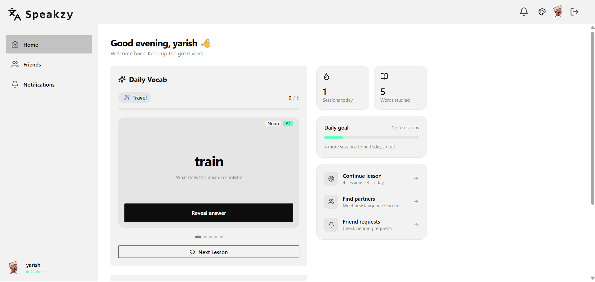
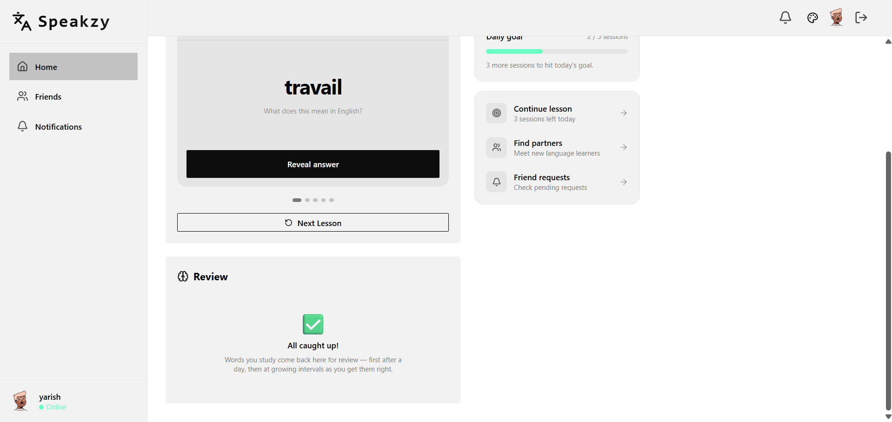
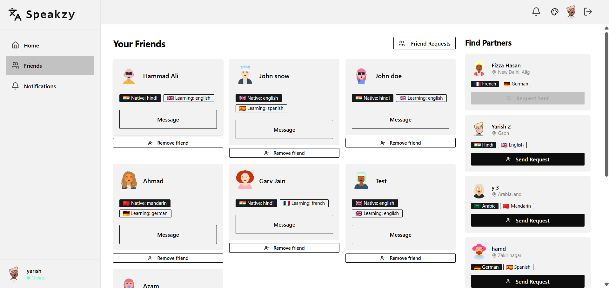
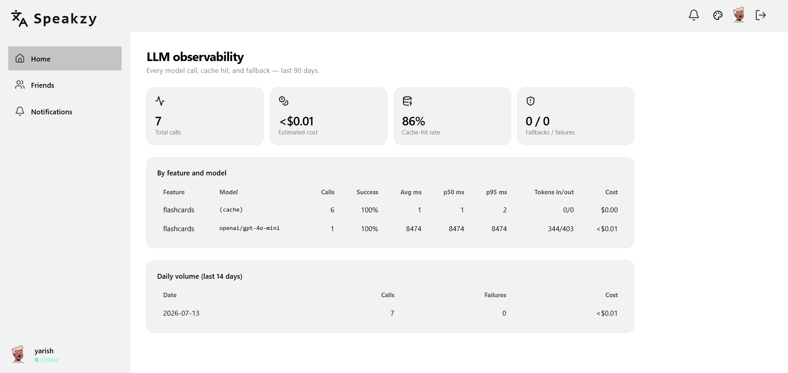

# Speakzy

> A full-stack language-exchange platform where learners connect, chat and video-call in real time, and practice vocabulary with AI-generated flashcards.

[](https://github.com/Yarish652/Speakzy/actions/workflows/ci.yml)

**Live demo:** https://speakzy-9rkd.onrender.com

Speakzy pairs people who want to learn each other's languages. You pick your native and target languages during onboarding, get matched with other learners, send friend requests, and then chat or jump on a video call to practice. A built-in AI tutor generates a fresh set of beginner vocabulary flashcards each day.

---

## Screenshots

**Home - AI daily vocab with study stats and daily goal:**



**Spaced-repetition review deck (Leitner system, zero LLM calls):**



**Find language partners and manage friends:**



**Admin LLM observability - latency percentiles, cache-hit rate, cost per model:**



---

## Features

- **JWT authentication** with secure `httpOnly` cookies, bcrypt-hashed passwords, and a NoSQL-injection-safe validation layer.
- **Onboarding flow** to set native language, target language, bio, and location.
- **Friend system** - matchmaking recommendations, send / accept / decline friend requests, and remove friends. Requests and recommendations are paginated and bounded server-side.
- **Real-time 1:1 chat** with typing indicators and unread-message notifications (powered by Stream Chat).
- **Video calling** with a shareable in-chat call link (powered by Stream Video).
- **AI vocabulary flashcards** - generates 5 beginner (A1) cards per themed set for your language pair, with:
  - a **primary/fallback model strategy** (GPT-4o-mini falling back to Gemini Flash) so a single provider outage doesn't break the feature,
  - a **per-user daily quota** to control cost,
  - **response caching** so repeat views are served from the database instead of re-calling the LLM, and
  - **schema-validated LLM output** (Zod) so malformed generations are retried instead of reaching users.
- **Study tracking** - every card you reveal is recorded server-side, so your "words studied" stats follow your account across devices (and feed personalization).
- **RAG-personalized generation** - new flashcard sets are grounded in your study history: words you've already studied are excluded (prompt rule + server-side post-filter with one replacement retry), and words you know that are semantically related to the day's theme are retrieved by vector similarity and woven into example sentences (comprehensible input). Degrades gracefully on cold start or when embeddings are unconfigured.
- **Spaced-repetition review deck (Leitner system)** - studied words come back for revision at growing intervals (1/2/4/7/14 days); right answers push a word up a box, wrong answers reset it to tomorrow. Cards replay from stored snapshots - the review loop makes zero LLM calls.
- **Theming** with a daisyUI theme selector, and a responsive layout that stacks cleanly on mobile.

**Where this is heading:** retrieval-augmented personalized flashcards, a citation-backed grammar tutor, LLM observability, and a CI eval suite - see the [AI Roadmap](docs/AI_ROADMAP.md).

---

## Tech stack

| Layer      | Technologies |
|------------|--------------|
| Frontend   | React 19, Vite, React Router 7, TanStack Query, Zustand, Tailwind CSS + daisyUI, Stream Chat/Video React SDKs |
| Backend    | Node.js, Express, MongoDB + Mongoose, JWT, bcryptjs, Zod, Helmet, express-rate-limit |
| AI         | OpenRouter (GPT-4o-mini primary, Gemini 2.5 Flash fallback), Gemini embeddings |
| Realtime   | Stream Chat & Stream Video |
| Testing/CI | Vitest, Supertest, GitHub Actions (with a MongoDB service container) |
| Hosting    | Render |

---

## Architecture

```
Speakzy/
|-- backend/                  # Express API server
|   `-- src/
|       |-- controllers/      # Route handlers (auth, user, chat, ai)
|       |-- models/           # Mongoose schemas (User, FriendRequest, StudiedWord)
|       |-- routes/           # API route definitions
|       |-- middleware/       # protectRoute (JWT) + rate limiters
|       |-- lib/              # DB connection, Stream client, Zod schemas
|       |-- test/             # Vitest + Supertest integration tests
|       |-- app.js            # Express app (CORS, Helmet, routes)
|       `-- server.js         # Entry point + static frontend serving
`-- frontend/                 # React + Vite SPA
    `-- src/
        |-- pages/            # Route-level screens
        |-- components/       # Reusable UI (Navbar, Sidebar, FlashCardWidget...)
        |-- hooks/            # useAuthUser, useLogin, useInitStreamChat...
        |-- context/          # StudyStatsContext (study tracking)
        |-- store/            # Zustand stores (theme, chat)
        `-- lib/              # axios instance + API client
```

**Request flow:** the React SPA calls the Express API over `axios` (cookies carry the JWT). `protectRoute` middleware verifies the JWT on every protected route and attaches the user. Chat and video are handled client-side by the Stream SDKs, authenticated with a short-lived token minted by `GET /api/chat/token`. In production the backend also serves the built frontend as static assets.

---

## Getting started

### Prerequisites

- Node.js v18+ and npm
- MongoDB (local, or a MongoDB Atlas connection string)
- A [Stream](https://getstream.io/) account (API key + secret)
- An [OpenRouter](https://openrouter.ai/) API key (for the AI flashcards)

### 1. Clone and install

```bash
git clone https://github.com/Yarish652/Speakzy.git
cd Speakzy

# backend
cd backend && npm install

# frontend
cd ../frontend && npm install
```

### 2. Configure environment variables

Create `backend/.env`:

```env
PORT=5001
NODE_ENV=development
MONGO_URI=mongodb://localhost:27017/speakzy
JWT_SECRET_KEY=your_strong_random_secret
STREAM_API_KEY=your_stream_api_key
STREAM_API_SECRET=your_stream_api_secret
OPENROUTER_API_KEY=your_openrouter_api_key
# optional: comma-separated emails allowed to view /admin LLM stats
ADMIN_EMAILS=you@example.com
# optional: Google AI Studio key for embeddings (activates RAG-personalized
# flashcards; without it, generation still works via the exclusion list)
GEMINI_API_KEY=your_gemini_api_key
# optional: "memory" (default, works everywhere) or "atlas" ($vectorSearch,
# requires an Atlas vector index named studiedword_embedding)
VECTOR_DRIVER=memory
```

> Generate a strong JWT secret with:
> `node -e "console.log(require('crypto').randomBytes(32).toString('hex'))"`

Create `frontend/.env`:

```env
VITE_STREAM_API_KEY=your_stream_api_key
```

### 3. Run in development

```bash
# terminal 1 - backend (http://localhost:5001)
cd backend && npm run dev

# terminal 2 - frontend (http://localhost:5173)
cd frontend && npm run dev
```

---

## Testing

The backend has an integration test suite (Vitest + Supertest) covering auth, friend requests, study tracking, and the flashcard controller - including regression tests for a password-hash leak and NoSQL-injection attempts.

```bash
cd backend
npm test          # run once
npm run test:watch
```

CI runs the full backend suite against a real MongoDB service container and builds the frontend on every push and pull request - see [`.github/workflows/ci.yml`](.github/workflows/ci.yml).

### AI evals

The LLM pipeline has its own regression suite ([`backend/evals/`](backend/evals/)) that drives the real generation code against a 16-case golden dataset spanning 8 non-Latin scripts:

```bash
cd backend
npm run eval          # Tier 1: deterministic checks (schema, category,
                      # romanization, script sanity, duplicates, exclusions)
npm run eval:judge    # Tier 2: LLM-as-judge quality scoring with committed
                      # per-prompt-version baselines (drift detection)
```

The judge model (Gemini) is a different family from the generator (GPT) to avoid self-preference bias. Tier 1 runs in CI on backend changes; Tier 2 runs weekly - see [`.github/workflows/ai-evals.yml`](.github/workflows/ai-evals.yml). On its first run the suite caught a delisted fallback model and an unbounded `max_tokens` - it paid for itself on day one.

---

## API reference

All protected routes require the JWT cookie set at login.

### Auth - `/api/auth`
| Method | Endpoint      | Description |
|--------|---------------|-------------|
| POST   | `/signup`     | Create an account (rate-limited, validated) |
| POST   | `/login`      | Log in, sets the JWT cookie (rate-limited) |
| POST   | `/logout`     | Clear the session cookie |
| POST   | `/onboarding` | Complete profile (languages, bio, location) |
| GET    | `/me`         | Get the current authenticated user |

### Users - `/api/users`
| Method | Endpoint                        | Description |
|--------|---------------------------------|-------------|
| GET    | `/?page=&limit=`                | Paginated learner recommendations |
| GET    | `/friends`                      | List my friends |
| POST   | `/friend-request/:id`           | Send a friend request |
| PUT    | `/friend-request/:id/accept`    | Accept a request |
| DELETE | `/friend-request/:id`           | Decline a request |
| GET    | `/friend-requests`              | Incoming + accepted requests |
| GET    | `/outgoing-friend-requests`     | Pending outgoing requests |
| DELETE | `/friends/:id`                  | Remove a friend |

### Chat - `/api/chat`
| Method | Endpoint  | Description |
|--------|-----------|-------------|
| GET    | `/token`  | Mint a Stream token for the current user |

### AI - `/api/ai`
| Method | Endpoint            | Description |
|--------|---------------------|-------------|
| GET    | `/flashcards`       | Today's flashcard set (cached, or generated) |
| POST   | `/flashcards/next`  | Generate the next set (counts against daily quota) |
| POST   | `/study`            | Record a study event (card reveal / "I knew it") |
| GET    | `/study/today`      | Distinct words studied today (account-wide) |
| GET    | `/review`           | Due revision cards (Leitner scheduling, LLM-free) |
| POST   | `/review`           | Submit a review result (moves the word between boxes) |

### Admin - `/api/admin`
| Method | Endpoint     | Description |
|--------|--------------|-------------|
| GET    | `/llm-stats` | LLM observability: latency percentiles, cache-hit/fallback rates, est. cost (gated by `ADMIN_EMAILS`) |

---

## Engineering highlights

These are the decisions I'd want a reviewer to notice:

- **Tested and CI-gated.** Integration tests run against a real MongoDB in GitHub Actions, so the auth, friend, study, and flashcard flows are exercised end-to-end on every push - not just unit-mocked.
- **Security-first auth.** Passwords are bcrypt-hashed and stripped from every serialized response via a `toJSON` override; all request bodies pass through Zod schemas; route params are validated as Mongo ObjectIds; and login/signup are protected by tiered `express-rate-limit` limiters (with `skipSuccessfulRequests` so real users aren't punished for a typo). Helmet sets security headers.
- **Resilient AI feature.** The flashcard endpoint validates LLM output against a Zod schema, falls back to a second LLM provider on failure, caps usage per user per day, and caches generated sets in the database - turning a potentially expensive, flaky call into a fast, bounded one.
- **Bounded queries.** Recommendation results are paginated server-side (`page`/`limit`, capped) so the endpoint never returns the entire users collection as the app grows.
- **Idempotent study tracking.** Study events upsert into a uniquely-indexed collection (one doc per user/language/word), so repeat reveals increment counters instead of duplicating rows - and double-fired client events are harmless.
- **LLM observability.** Every model call (including cache hits and fallbacks) is logged fire-and-forget to a TTL'd `LlmCall` collection with latency, token usage, estimated cost, and prompt version - surfaced in an admin dashboard (`/admin`) with p50/p95 latency, cache-hit rate, and daily spend. Logging failures never break user responses.
- **Pragmatic vector search.** Retrieval runs behind a two-driver interface: brute-force cosine in Node for a user's own words (hundreds of vectors - an index would be overkill, and it runs identically in CI), with an Atlas `$vectorSearch` driver for corpora that outgrow it. The generation pipeline never trusts the model to respect its exclusion list - a server-side post-filter enforces it.

An [AI Roadmap](docs/AI_ROADMAP.md) documents the next phases: RAG-personalized generation, a grammar tutor with citations, LLM observability, and a CI eval suite - each with a mandatory verification gate.

---

## License

ISC - this is a personal learning project.
